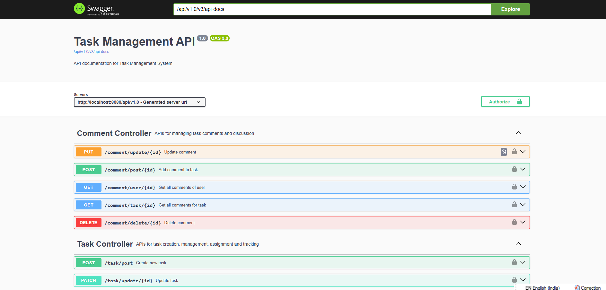
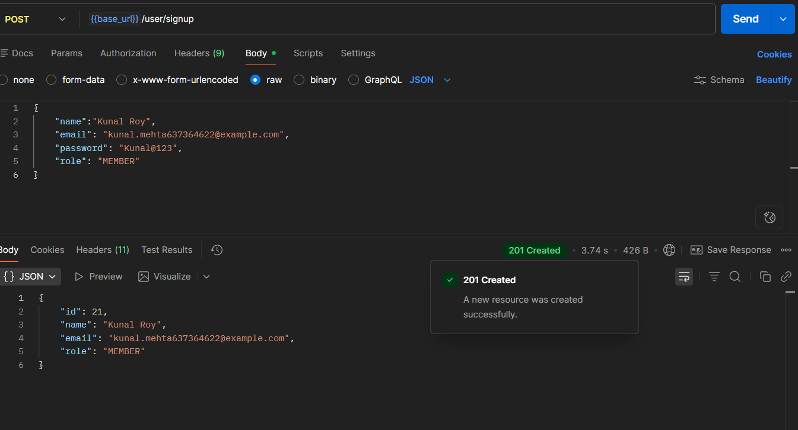
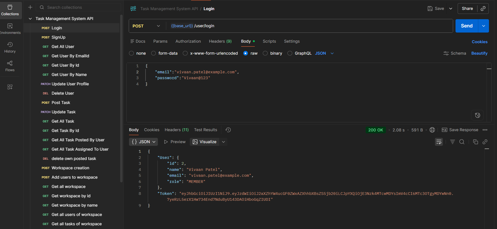
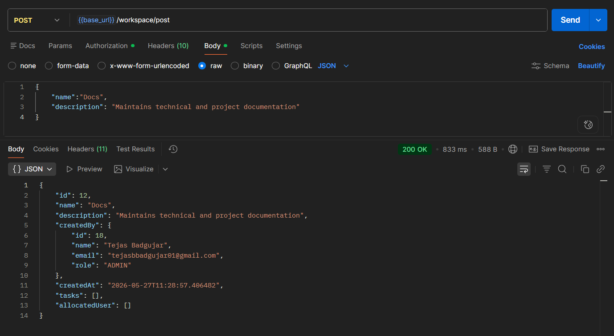
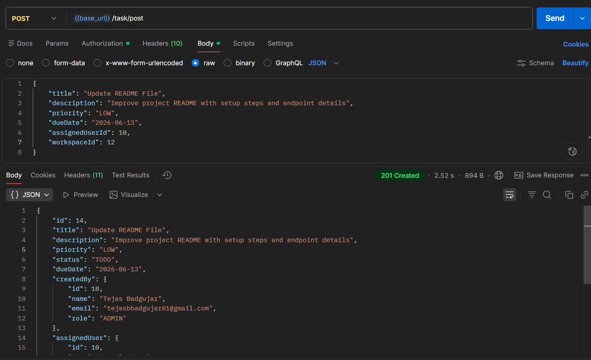
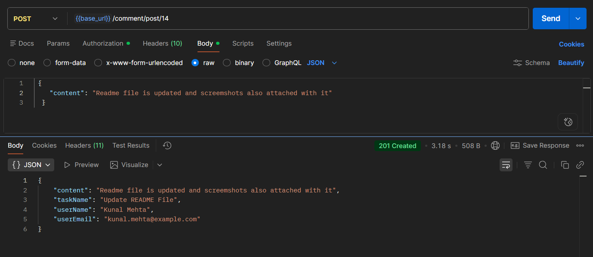
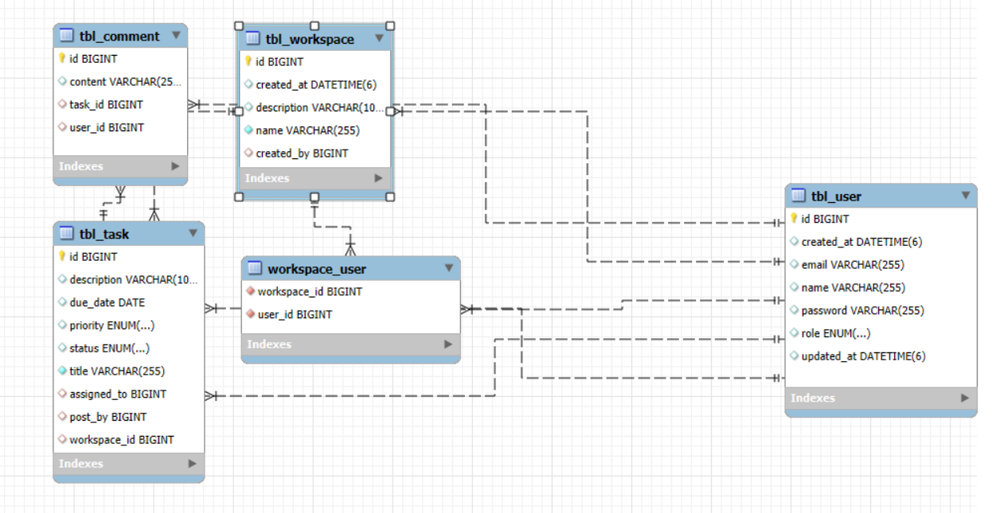

# Task Management System

A secure and collaborative backend application built using Spring Boot for managing tasks, workspaces, users, and team collaboration.

This project focuses on real-world backend development concepts such as:

* JWT Authentication & Authorization
* Role-Based Access Control
* Workspace Collaboration
* Task Assignment & Tracking
* Email Notifications
* Pagination & Validation
* Exception Handling
* Clean Service Layer Architecture
* DTO Pattern
* Logging & Monitoring

---

# Tech Stack

| Technology       | Purpose                           |
| ---------------- | --------------------------------- |
| Java 17          | Core Programming Language         |
| Spring Boot      | Backend Framework                 |
| Spring Security  | Authentication & Authorization    |
| JWT              | Secure Token-Based Authentication |
| Spring Data JPA  | Database Operations               |
| Hibernate        | ORM Framework                     |
| MySQL            | Relational Database               |
| Lombok           | Boilerplate Reduction             |
| Java Mail Sender | Email Notifications               |
| Swagger/OpenAPI  | API Documentation                 |
| Maven            | Dependency Management             |
| Spring Mail      | Email Service Integration         |
| Brevo SMTP       | Email Delivery Provider           |

---

# Features

## Authentication & Security

* User Registration
* User Login
* JWT Token Generation
* Stateless Authentication
* Protected APIs using Spring Security
* Role-Based Authorization

## User Management

* Register new users
* Update user profile
* Delete user
* Fetch user details
* Public profile access

## Workspace Management

* Create workspace
* Update workspace
* Delete workspace
* Add users to workspace
* Fetch all users in workspace
* Fetch all tasks in workspace

## Task Management

* Create task
* Update task
* Delete task
* Assign task to workspace members
* Task priority handling
* Task status updates
* Due date tracking

## Comment System

* Add comments to tasks
* Update comments
* Delete comments
* Fetch comments by task
* Fetch comments by user

## Email Notifications

Automatic email notifications are sent for:

* User Registration
* Task Assignment
* Task Status Updates
* Workspace Invitations

---

# Project Structure

```text
src/main/java/com/Tejas/TaskManagementSystem
│
├── Controller        -> REST APIs
├── DTO               -> Request & Response Objects
├── Entity            -> Database Models
├── Enum              -> Enums like Role, Priority, Status
├── Exception         -> Custom Exception Handling
├── Repository        -> JPA Repositories
├── Security          -> JWT Filter & Security Config
├── Service           -> Business Logic Layer
├── Util              -> Utility Classes (JWT)
└── TaskManagementSystemApplication.java
```

---

# Application Flow

## 1. User Registration Flow

```text
Client Request
      ↓
UserController
      ↓
UserService
      ↓
Password Encoding
      ↓
User Saved in Database
      ↓
Welcome Email Sent
      ↓
Response Returned
```

---

## 2. User Login Flow

```text
Client Login Request
      ↓
AuthenticationManager
      ↓
CustomUserDetailsService
      ↓
User Validation
      ↓
JWT Token Generated
      ↓
Token Returned to Client
```

---

## 3. JWT Authentication Flow

```text
Client Sends JWT Token
      ↓
JwtFilter Intercepts Request
      ↓
Token Validation
      ↓
Extract Username
      ↓
Load User Details
      ↓
Set Authentication in SecurityContext
      ↓
Access Protected APIs
```

---

## 4. Workspace Management Flow

```text
Workspace Creator
      ↓
Create Workspace
      ↓
Add Team Members
      ↓
Users Receive Email Notification
      ↓
Members Collaborate Inside Workspace
```

---

## 5. Task Management Flow

```text
Workspace Creator
      ↓
Create Task
      ↓
Assign Task to Workspace Member
      ↓
Email Notification Sent
      ↓
Assigned User Updates Task Status
      ↓
Status Update Notification Sent
```

---

## 6. Comment System Flow

```text
User Accesses Task
      ↓
Add Comment
      ↓
Comment Linked with Task & User
      ↓
Comments Retrieved with Pagination
```

---

# Security Flow

The application uses Spring Security with JWT-based authentication.

## Public Endpoints

* `/user/signup`
* `/user/login`
* Swagger APIs

## Protected Endpoints

All other endpoints require:

* Valid JWT Token
* Proper Authentication

JWT tokens are validated using:

* Secret Key
* Username Verification
* Expiration Verification

---

# Validation

The application uses Jakarta Validation for request validation.

Examples:

* `@NotBlank`
* `@NotNull`
* `@Size`
* `@Future`

This ensures invalid data never reaches business logic.

---

# Logging

SLF4J Logging is implemented across services and security layers.

Logs are used for:

* Authentication tracking
* Error tracking
* Debugging
* Request monitoring
* Unauthorized access monitoring

---

# API Documentation

Swagger/OpenAPI is integrated.

Swagger URL:

```text
http://localhost:8080/swagger-ui/index.html
```

---

# Database Design Overview

## Main Entities

* UserEntity
* Workspace
* TaskEntity
* Comment

## Relationships

### User ↔ Workspace

* Many users can belong to many workspaces.

### Workspace ↔ Task

* One workspace can contain multiple tasks.

### User ↔ Task

* One user can create many tasks.
* One user can be assigned many tasks.

### Task ↔ Comment

* One task can contain multiple comments.

---

# Screenshots

## Swagger API Documentation

> 

---

## User Registration API

> 

---

## Login API & JWT Token

>

---

## Workspace Creation

>

---

## Task Creation

> 

---

## Comment APIs

> 

---

## Database Tables

> 

---

# Setup Instructions

## 1. Clone Repository

```bash
git clone <your-github-repository-url>
```

---

## 2. Configure Database

Update `application.properties`:

```properties
spring.datasource.url=YOUR_DATABASE_URL
spring.datasource.username=YOUR_USERNAME
spring.datasource.password=YOUR_PASSWORD
```

---

## 3. Configure JWT Secret

```properties
jwt.secret.key=YOUR_BASE64_SECRET_KEY
```

---

## 4. Configure Email Service

Set the following environment variables:

```properties
BREVO_EMAIL_HOST=smtp-relay.brevo.com
BREVO_EMAIL_PORT=587
BREVO_USERNAME=your-email
BREVO_PASSWORD=your-password
BREVO_EMAIL_FROM=your-email
```

---

## 5. Run Application

```bash
mvn spring-boot:run
```

---


# Learning Outcomes

This project demonstrates practical understanding of:

* Spring Boot Architecture
* JWT Authentication
* REST API Design
* Layered Architecture
* DTO Pattern
* Exception Handling
* Spring Security
* Email Integration
* Pagination
* Validation
* Clean Code Practices

---

# Author

## Tejas Badgujar

Backend Developer focused on Java & Spring Boot development.

---

# License

This project is created for learning and portfolio purposes.
